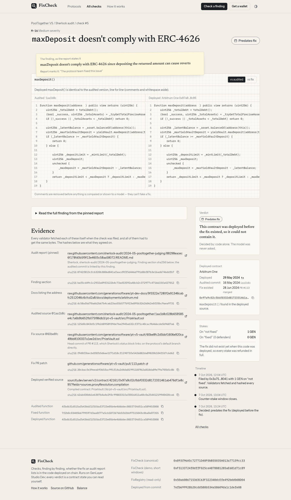

# FixCheck

**The audit says it was fixed. Is the fix in the deployed code?**

Live: **https://fixcheck-ledger.vercel.app** · GenLayer Studio Dev · contracts in [`contracts/`](contracts/) · demo video: [`docs/demo/fixcheck-demo-voiced.mp4`](docs/demo/fixcheck-demo-voiced.mp4) ([vertical cut](docs/demo/fixcheck-demo-vertical.mp4))

Recorded on the previous deployment (addresses in docs/superseded/README.md); the flow is unchanged.

## The problem

Public audit reports (Sherlock, Code4rena, Cantina…) end with a list of findings and a status: *Fixed*. Users read "audited, all fixed" and trust the protocol. Nobody checks whether the code that is actually deployed on chain contains each fix. Sometimes it doesn't: the fix was merged in the repository but the deployed contract was never replaced, the contract was deployed before the audit and can't be upgraded, or it was deployed before the fix even existed.

FixCheck checks it, one finding at a time, using the real report, the real commits and the verified code running at the protocol's own listed address. **Supports Sherlock contest reports; other auditors are future work.**

## What it found

The seeds are **22 checks of 21 findings**: 21 Sherlock findings marked fixed, with PoolTogether M-1 checked on two chains (OP Mainnet and Arbitrum). They cover PoolTogether V5, Mellow Flexible Vaults, Cap and the OP Stack fault proofs. Every check is listed in [`docs/SEEDS.md`](docs/SEEDS.md); how the data was chosen is in [`docs/RESEARCH.md`](docs/RESEARCH.md).

* **Fixed in deployed code** — the deployed function is the fix commit's, or holds the fix in place.
* **Not fixed** — the deployed function is still the audited version, on code deployed *after the fix existed*: PoolTogether's Ethereum vault, created 2024-08-19 by a factory deployed that day, while its fix (PR #112) was merged on 2024-06-28.
* **Predates audit** — six PoolTogether contracts (prize pool, vaults on OP Mainnet and Base, draw manager, RNG) still run the audited code, but they were deployed before the audited commit (2024-05-16) and are not upgradeable, so the fix could not have been applied there. FixCheck says so instead of calling them "not fixed".
* **Predates fix** — PoolTogether's Arbitrum vault was deployed on 2024-05-29, after the audit but before its fix existed (PR #113, committed 2024-06-21, merged 2024-06-28). This contract was deployed before the fix existed, so it could not contain it.
* **Inconclusive** — code could not prove which function runs (partially verified source), or the model's answers did not point at the fix. Everyone is refunded; no verdict is invented.

These are code facts, not claims about exploitability or anyone's intent.

## How it works

1. **File.** A challenger stakes GEN on *not fixed* and names: a **pinned Sherlock** report (a `sherlock-audit/*-judging` repo on GitHub raw at a commit SHA, or a web.archive.org capture of one or of `audits.sherlock.xyz`), the finding id, the function, the audited source file at its commit, the **fix commit's** file (required), the chain, the deployed address, and a **pinned** docs page of the protocol that lists that address.
2. **Validators read everything themselves** and must agree on every field and on the sha256 of every immutable body. Code checks, before anything is stored:
   * every link is pinned and spelled one way (no `%`-escapes); an archived capture must be dated no later than the filing, and the capture served must be exactly that one (its `Memento-Datetime`);
   * the report's and the docs' pinned GitHub commits are on a **branch of the repository each URL names** (not only in a fork, a pull request or a tag; a renamed repo must be named as it is now); the branch is stored as proof;
   * the finding heads a section of the report and names the function, and **Sherlock's own status block** marks it fixed — on **GitHub's issue page** for that finding, written by a `sherlock-admin*` account and linking this fix;
   * the audited file is the finding's own audited commit (a code link in the finding's section, or in the same report); the fix file is the head of the PR — or a commit — that Sherlock's status block links. Comments by anyone else are never read for the fix;
   * the fix is in the protocol's own GitHub account (the owner of its pinned docs) and on its **default branch**, directly or through the PR's merge commit; the fix commit's date and the PR's merge date are recorded;
   * the docs page lists the address, and the contract has a **full/exact** verified-source match;
   * a proxy is resolved through its EIP-1967 slot, read at a block the leader names and every validator re-reads (it must still hold the current implementation, with no `Upgraded` event above it), cross-checked with the explorer; only the implementation's code is judged; a beacon proxy is inconclusive;
   * every chain fact — slots, the creation block's time and code, the switch's `Upgraded` event and time — is read from **two RPCs run by different operators** and must agree exactly; a creation date counts only if that block created the code that runs now;
   * the function belongs to the contract the explorer says was **compiled** at that address, or to one of its parents (resolved through import aliases); nothing in that chain overrides it, nor a function or modifier it — or the fix — calls;
   * the audited commit's date, the creation time of the deployment (and of its implementation) and the block of the proxy's switch to that implementation are recorded.

   Anything unpinned, unreadable, unlinked or from another source is refused, and the stake stays withdrawable.
3. **Counter-stake.** Until the counter deadline (1 hour on the canonical contract) anyone else may stake *fixed*.
4. **Decide** (anyone, after the deadline). Code decides first:
   * deployed == fix version → **FIXED** (`CODE_MATCH_FIX`)
   * deployed == audited version → **NOT FIXED** (`CODE_MATCH_VULNERABLE`) — or **PREDATES AUDIT** (`DEPLOYED_BEFORE_AUDIT`) when the code that runs was chosen before the audited commit, or **PREDATES FIX** (`DEPLOYED_BEFORE_FIX`) when it was chosen before the fix existed. "Chosen" is the creation of the deployment; for a proxy, the **latest** of the proxy's creation, the implementation's creation and the proxy's switch to that implementation. The fix date is the later of the fix commit's date and its PR's merge date. Only code chosen after the fix existed can be NOT FIXED; when a date that matters can't be proven (undated switch, sources disagree, code changed since creation) → **INCONCLUSIVE** (`UPGRADE_TIME_UNKNOWN` / `DEPLOY_TIME_UNKNOWN`)
   * every fix hunk present as one block, with the fix's own context lines, inside exactly the branches/loops (and at the absolute depth) that enclose it in the fix, with no `return`/`revert`/`throw`/`selfdestruct` before it that the fix doesn't have, and no removed line left; a line the fix only moved must appear in the fix's order and only there → **FIXED** (`CODE_CONTAINS_FIX`)
   * function missing, overloaded, overridden, not in the compiled contract, a parent unresolved, a called function or modifier overridden, partially verified, proxy unresolved, beacon proxy, or the two RPCs disagree on the code that runs → **INCONCLUSIVE**
   * otherwise the model only resolves what code can't: it is shown the finding, what the fix commit changed in this function, and the deployed function (comments removed, string literals blanked), and must quote deployed lines. Code accepts FIXED only if a quote is a line the fix **added that the audited version does not have** and no line the fix removed is still deployed; NOT FIXED only if a quote is a **removed** (vulnerable) line that is still deployed — and on code created before the fix existed that becomes PREDATES FIX. A fix that only moves lines can never be grounded by the model; code checks the order. It is asked twice; any disagreement, unsupported quote or error → **INCONCLUSIVE**.
5. **Pay out.** NOT FIXED: the challenger takes every defender stake. FIXED: defenders split the challenger's stake (no defender: challenger refunded minus a frozen 2% fee). INCONCLUSIVE, PREDATES AUDIT or PREDATES FIX: everyone refunded. Payouts are credited and withdrawn (pull). If nobody decides before the decide deadline, anyone can `expire` and everyone is refunded.

### What the model is never allowed to decide

* which report, finding, commits or deployment are the evidence — code binds them to the finding, to Sherlock's own status block and to the protocol's default branch;
* whether two functions are identical, or whether the fix is present in place and on the live path — code compares them;
* whether a contract predates the audit or the fix, is a proxy, is fully verified, or compiles the function that was judged — code reads it on chain;
* whether a line that the fix only moved is in the right order — code checks it; the model can never ground such a fix;
* anything from text inside comments or string literals — they are removed before it reads the code;
* a verdict on its own word — its quotes must be exact deployed lines that touch what the fix changed, and two answers must agree;
* deadlines, stakes, fees or payouts.

Ledger invariant, checked after every call in the tests and shown live on `/balance`:
`balance_wei == open_stakes_wei + claimable_wei + fees_wei`.

## How to use (5 steps)

1. Open **https://fixcheck-ledger.vercel.app/check** and connect a wallet; the app adds/switches to GenLayer Studio Dev (GEN there is free test currency).
2. Paste the pinned report link and the audited and fix source files — or click one of the real examples.
3. Enter the finding id and function, then the chain, the deployed address and the protocol's pinned docs page.
4. Review: the app runs the same checks the contract will and tells you what code will decide before you pay.
5. Stake and follow the transaction to the result card. After the counter-stake window anyone can press **Decide**; winnings and refunds land in **Balance** for you to withdraw.

## Contracts (Studio Dev, chain 61997)

| Contract | Address |
|---|---|
| FixCheck — canonical (1 h counter, 24 h decide) | `0x263C6a42B98E9133CF85A00A436b05C3573B88fe` |
| FixCheck — demo (90 s counter, 300 s decide) | `0x19bc7Cb16Ce1B4F328f33d0FDfeA61297dA04f68` |
| FixRegistry — read-only consumer | `0xA37F98977f023D8C0bd17aCF1A7983E5d328d9A4` |

Deployed from commit `8519168641d560b7528f3a23640c7722598c16fe` with the bytes of `git show <commit>:<file>`; `node tools/verify_source.mjs` reads the code back from the chain and confirms all three are byte-identical to HEAD. sha256 and deploy transactions: [`ADDRESSES.md`](ADDRESSES.md). Explorer: https://explorer-studio-dev.genlayer.com/

Other apps read verdicts with `FixRegistry.fix_status(chain, address, "<pinned report url>#<finding id>")` (or `is_fixed` / `is_known_unfixed`; `is_known_unfixed` is false for PREDATES AUDIT) — free cross-contract views, no payable methods. Earlier versions are listed in [`docs/superseded/`](docs/superseded/).

## Seeds

All 22 checks of 21 findings from Step 0 (PoolTogether M-1 on two chains), on the canonical contract, read from chain:

| # | Protocol | Finding | Function | Chain | Verdict | Basis | Model |
|---|---|---|---|---|---|---|---|
| [1](https://fixcheck-ledger.vercel.app/checks/1) | PoolTogether V5 | M-5 | `claimPrizes` | optimism | **FIXED** | CODE_MATCH_FIX | — |
| [2](https://fixcheck-ledger.vercel.app/checks/2) | PoolTogether V5 | M-8 | `_computeFeePerClaim` | base | **FIXED** | CODE_MATCH_FIX | — |
| [3](https://fixcheck-ledger.vercel.app/checks/3) | PoolTogether V5 | M-15 | `shutdownAt` | optimism | **PREDATES_AUDIT** | DEPLOYED_BEFORE_AUDIT | — |
| [4](https://fixcheck-ledger.vercel.app/checks/4) | PoolTogether V5 | M-9 | `liquidatableBalanceOf` | optimism | **PREDATES_AUDIT** | DEPLOYED_BEFORE_AUDIT | — |
| [5](https://fixcheck-ledger.vercel.app/checks/5) | PoolTogether V5 | M-16 | `maxDeposit` | arbitrum | **PREDATES_FIX** | DEPLOYED_BEFORE_FIX | — |
| [6](https://fixcheck-ledger.vercel.app/checks/6) | PoolTogether V5 | M-17 | `_convertToShares` | ethereum | **NOT_FIXED** | CODE_MATCH_VULNERABLE | — |
| [7](https://fixcheck-ledger.vercel.app/checks/7) | PoolTogether V5 | M-19 | `claimPrize` | base | **PREDATES_AUDIT** | DEPLOYED_BEFORE_AUDIT | — |
| [8](https://fixcheck-ledger.vercel.app/checks/8) | PoolTogether V5 | M-1 | `isRequestComplete` | optimism | **PREDATES_AUDIT** | DEPLOYED_BEFORE_AUDIT | — |
| [9](https://fixcheck-ledger.vercel.app/checks/9) | PoolTogether V5 | M-1 | `isRequestComplete` | arbitrum | **FIXED** | CODE_MATCH_FIX | — |
| [10](https://fixcheck-ledger.vercel.app/checks/10) | PoolTogether V5 | M-14 | `canStartDraw` | optimism | **PREDATES_AUDIT** | DEPLOYED_BEFORE_AUDIT | — |
| [11](https://fixcheck-ledger.vercel.app/checks/11) | PoolTogether V5 | H-3 | `startDrawReward` | optimism | **PREDATES_AUDIT** | DEPLOYED_BEFORE_AUDIT | — |
| [12](https://fixcheck-ledger.vercel.app/checks/12) | Mellow Flexible Vaults | H-1 | `checkSignatures` | ethereum | **FIXED** | CODE_MATCH_FIX | — |
| [13](https://fixcheck-ledger.vercel.app/checks/13) | Mellow Flexible Vaults | H-2 | `_handleReport` | ethereum | **INCONCLUSIVE** | MODEL_UNGROUNDED | UNGROUNDED|UNGROUNDED |
| [14](https://fixcheck-ledger.vercel.app/checks/14) | Mellow Flexible Vaults | H-3 | `callHook` | ethereum | **INCONCLUSIVE** | PARTIAL_MATCH | — |
| [15](https://fixcheck-ledger.vercel.app/checks/15) | Mellow Flexible Vaults | H-4 | `calculateFee` | ethereum | **INCONCLUSIVE** | MODEL_UNGROUNDED | UNGROUNDED|INCONCLUSIVE |
| [16](https://fixcheck-ledger.vercel.app/checks/16) | Mellow Flexible Vaults | H-5 | `calculateFee` | ethereum | **FIXED** | CODE_MATCH_FIX | — |
| [17](https://fixcheck-ledger.vercel.app/checks/17) | Mellow Flexible Vaults | M-1 | `updateChecks` | ethereum | **INCONCLUSIVE** | MODEL_UNGROUNDED | UNGROUNDED|UNGROUNDED |
| [18](https://fixcheck-ledger.vercel.app/checks/18) | Mellow Flexible Vaults | M-4 | `handleReport` | ethereum | **FIXED** | CODE_MATCH_FIX | — |
| [19](https://fixcheck-ledger.vercel.app/checks/19) | Mellow Flexible Vaults | M-5 | `cancelDepositRequest` | ethereum | **FIXED** | CODE_CONTAINS_FIX | — |
| [20](https://fixcheck-ledger.vercel.app/checks/20) | Cap | M-1 | `liquidate` | ethereum | **INCONCLUSIVE** | PARTIAL_MATCH | — |
| [21](https://fixcheck-ledger.vercel.app/checks/21) | Cap | M-3 | `realizeRestakerInterest` | ethereum | **INCONCLUSIVE** | PARTIAL_MATCH | — |
| [22](https://fixcheck-ledger.vercel.app/checks/22) | OP Stack fault proofs | M-3 | `create` | ethereum | **INCONCLUSIVE** | PARTIAL_MATCH | — |

Full table with links, stakes, dates and the demo paths: [`docs/SEEDS.md`](docs/SEEDS.md).

## Repository

| Path | What |
|---|---|
| `contracts/FixCheck.py` | the contract (GenVM v0.6 format) |
| `contracts/FixRegistry.py` | read-only consumer |
| `test/test_fixcheck.py`, `test/test_attacks*.py` | offline suites on real fetched evidence, 205 tests, no expected failures — `python3 -m unittest discover -s test -p "test_*.py"` |
| `tools/scan_writes.py` | static check: no state written before any revert |
| `test/deploy.mjs`, `test/seed_*.mjs` | HEAD-only deploy, resumable seeding |
| `tools/` | research pipeline, source verification, docs generators, screenshots, video |
| `frontend/` | Next.js app (Vercel Root Directory) |
| `docs/` | research, threat model, attack report, seeds, screenshots, demo video |

## Known limitations

Each item is either fixed or states why it stays. Fixed in round 4 ([`docs/ATTACK_REPORT_R4.md`](docs/ATTACK_REPORT_R4.md)): modifiers are now followed (an overridden modifier is `HELPER_OVERRIDDEN`); a status block counts only if GitHub's issue page shows a `sherlock-admin` account wrote it; every chain fact the RPCs can see is read from two RPCs run by different operators; docs captured on the Wayback Machine at a GitHub commit are accepted.

* **One function per finding** (by design). The model is shown one deployed function and what the fix changed in it, which keeps every answer checkable against quoted lines. A fix that lives in another function looks "changed"; code confirms it only by exact match or by containment, otherwise the check is inconclusive.
* **Comments and whitespace are ignored; everything else counts** (by design). A renamed variable or a reordered statement inside the fix's lines is a change, so code cannot decide FIXED by containment and the model must ground its answer.
* **Removal-only fixes** (by design). When the fix only deletes lines there is no added line the model could quote, so FIXED needs an exact code match; otherwise the check ends inconclusive.
* **"Not fixed" is a code fact, not an exploit claim** (by design). Exploitability depends on configuration.
* **Verified source comes from one explorer per chain.** Blockscout (Ethereum, OP Mainnet) or Sourcify (Base, Arbitrum, Polygon); only full/exact matches are judged. A second source can't be added on Studio Dev: Blockscout for Base, Arbitrum and Polygon answers GenVM with a bot challenge, and Etherscan needs an API key, which would be public in contract source. Chain facts are cross-checked by two RPCs (the code at the slot block must also be the code created in the explorer's creation block).
* **Proxy switches are dated only on Ethereum and OP Mainnet.** Their Blockscout lists a proxy's `Upgraded` logs; the last one is confirmed by both RPCs. Base, Arbitrum and Polygon have no log source reachable from GenVM (Sourcify keeps no logs; the RPCs refuse `eth_getLogs` over a proxy's lifetime), so a proxy there whose dates are all before the fix is INCONCLUSIVE (`UPGRADE_TIME_UNKNOWN`), never PREDATES and never NOT_FIXED. Beacon proxies are INCONCLUSIVE (`BEACON_PROXY`) by design: a second contract chooses the code.
* **Sherlock only.** Reports come from `sherlock-audit/*-judging` repos (or archive captures of them or of `audits.sherlock.xyz`). Other auditors are not added now because each publishes in its own format with its own way of saying who marked a finding fixed; round 2 showed that accepting reports from any author is forgeable, so each needs its own authorship rule.
* **A capture of `audits.sherlock.xyz` has no GitHub issue to check the status author against.** For those reports the status block's author line is the only evidence (round-2 fix 9 still requires the fix to be in the protocol's account and on its default branch).
* **Fix provenance comes from GitHub's HTML** (by design: the API's anonymous rate limit is too low for validators). A PR merged into a side branch counts from its merge date; when it later reached the default branch is not published anywhere a contract can read.
* **Inheritance is resolved by name and import path.** Anything ambiguous or unresolved is inconclusive rather than a guess. External calls (`x.f()`) are not followed: the callee is another contract whose code is not part of this verification.
* **Report and docs commits must be on a branch of the repository the URL names, at filing.** A pull request's head, a tag, a fork or a renamed repo's old name is refused; a branch deleted after filing changes nothing stored. GitHub throttling refuses the filing (nothing written; file again).
* **The same code redeployed at the same address keeps its first creation date.** A metamorphic redeploy with *different* code is detected (`CODE_CHANGED`); one with byte-identical code cannot be told apart from never having left, which needs history no RPC on Studio Dev serves.
* **Studio Dev** (by design for this submission). A development network; windows are short so the canonical deployment can be seeded and decided in a day, and value transfers are queued by the network.
