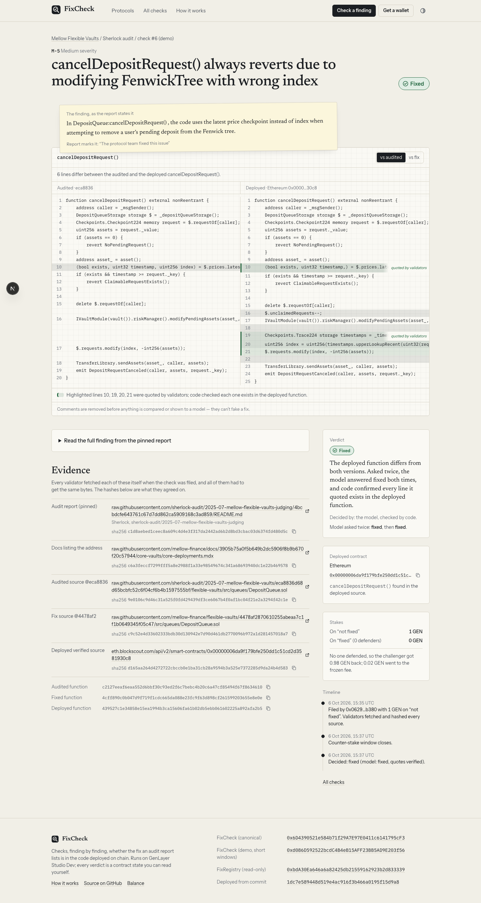

# FixCheck

**The audit says it was fixed. Is the fix in the deployed code?**

Live: **https://fixcheck-ledger.vercel.app** · GenLayer Studio Dev · contracts in [`contracts/`](contracts/)

## The problem

Public audit reports (Sherlock, Code4rena, Cantina…) end with a list of findings and a status: *Fixed*. Users read "audited, all fixed" and trust the protocol. Nobody checks whether the code that is actually deployed on chain contains each fix — and sometimes it doesn't. The contract may have been deployed before the audit, or from an older commit, or the fix was merged to the repo but never shipped.

FixCheck checks it, finding by finding, with the real report, the real commits and the real verified code on chain.

## What we found (Step 0, before any contract code)

22 real findings marked fixed in Sherlock reports, across PoolTogether V5, Mellow Flexible Vaults, Cap and the OP Stack fault proofs, checked against the addresses each protocol's own docs list ([`docs/RESEARCH.md`](docs/RESEARCH.md)). Offline, with the exact extractor the contract runs, over 64 (finding, deployment) pairs on four chains:

* **13** deployed functions are identical to the fix commit,
* **43** are identical to the **audited, pre-fix** version,
* **7** changed in other ways (decided by the model on chain),
* **1** could not be compared.

The 43 are PoolTogether V5: its OP Mainnet PrizePool, POOL Prize Vault, DrawManager and RngWitnet were deployed on 2024-04-18 — before the May 2024 Sherlock contest — and are immutable; the fixes merged in June–July 2024 reached the Claimer (redeployed 2024-07-16, which matches the fix) but not those contracts. The Ethereum POOL Prize Vault, created 2024-08-19 *after* the fixes were merged, still matches the audited version of four vault functions. This is a code fact, not a claim about exploitability or intent; the evidence (dates, creation transactions, hashes) is in [`docs/RESEARCH.md`](docs/RESEARCH.md) §5.

**What seeding taught us.** On the first deployment (v1.0), the model — shown only the finding and the deployed function — answered NOT_FIXED for two Mellow functions that *do* contain the fix, and answered the same way both times it was asked. Reviewing each model verdict against the fix commit’s diff found those two; we kept v1.0's results as evidence (`docs/superseded/`), and shipped v1.1: code decides when the deployed function visibly contains the fix, the model sees what the fix changed, and a model verdict whose quotes don't point at the change is INCONCLUSIVE. Details: [`docs/RESEARCH.md`](docs/RESEARCH.md) §6.

## How it works

1. **File.** A challenger stakes GEN on *not fixed* and names: a **pinned** report (GitHub raw at a commit SHA, or a web.archive.org snapshot), the finding id, the function, the audited source file at its commit, optionally the fix commit's file, the chain, the deployed address, and a **pinned** docs page of the protocol that lists that address.
2. **Validators read everything themselves.** Every GenLayer validator fetches every URL and must get the same canonical fields and the same sha256 of every body. Code checks the finding heads a section of the report with a fixed-status phrase and names the function, the docs page lists the address, and the contract is verified (Blockscout for Ethereum and OP Mainnet, Sourcify for Base, Arbitrum and Polygon; a proxy is followed one hop). A deterministic parser extracts the function from the audited, fixed and deployed code, with comments removed. Anything unpinned, unreadable or unlisted is refused and the stake stays withdrawable.
3. **Counter-stake.** Until the counter deadline anyone else may stake *fixed*.
4. **Decide** (anyone, after the deadline):
   * deployed == fix version → **FIXED** (`CODE_MATCH_FIX`)
   * deployed == audited version → **NOT_FIXED** (`CODE_MATCH_VULNERABLE`)
   * deployed holds every line the fix added and none it removed → **FIXED** (`CODE_CONTAINS_FIX`)
   * function missing / renamed / overloaded / unparseable → **INCONCLUSIVE**
   * otherwise the model, shown only the finding text, what the fix commit changed in this function, and the deployed function, answers and quotes deployed lines. Code checks every quoted line exists in the function **and points at the change** (FIXED must quote a line the fix added or moved; NOT_FIXED must quote a line the fix removed that is still deployed). The model is asked twice; a flip or ungrounded answer is INCONCLUSIVE.
5. **Pay out.** NOT_FIXED: the challenger takes every defender stake. FIXED: defenders split the challenger's stake (no defender: challenger refunded minus a frozen 2% fee). INCONCLUSIVE: everyone refunded. Payouts are credited and withdrawn (pull). If nobody decides before the decide deadline, anyone can `expire` and everyone is refunded.

### What the model never decides

| Code decides | The model weighs in, narrowly |
|---|---|
| URL pinning, fetching, hashing every body | only when the deployed function matches neither version |
| finding in report, marked fixed, names the function | sees only the finding text and the deployed function |
| docs list the address; contract verified; proxy hop | answers FIXED / NOT_FIXED / INCONCLUSIVE + quotes lines |
| function extraction, canonical comparison, "contains the fix" | its words are never stored — only enums, basis and quote indices + hashes |
| every quoted line exists and points at the change; both answers agree | sees the fix commit's change for this function |
| duplicates, deadlines, every stake and payout | |

Ledger invariant, checked after every call in the tests and shown live on `/balance`:
`balance_wei == open_stakes_wei + claimable_wei + fees_wei`.

## How to use (5 steps)

1. Open **https://fixcheck-ledger.vercel.app/check** and connect a wallet; the app adds/switches to GenLayer Studio Dev (GEN there is free test currency).
2. Paste the pinned report link and the audited (and fix) source files — or click one of the real examples.
3. Enter the finding id and function, then the chain, the deployed address and the protocol's pinned docs page.
4. Review: the app runs the same checks the contract will and tells you what code will decide before you pay.
5. Stake and follow the transaction to the result card; share the finding page. After the counter-stake window anyone can press **Decide**; winnings land in **Balance** for you to withdraw.

## Contracts (Studio Dev, chain 61997)

| Contract | Address |
|---|---|
| FixCheck — canonical (1 h counter, 24 h decide) | `0x525D730a0fEe81881af646A784337e005cC4E833` |
| FixCheck — demo (90 s counter, 300 s decide) | `0x7bC20b8eAf5A80Ca717a5249029a75351234B24F` |
| FixRegistry — read-only consumer | `0xC96B4a0aAbf6902fBF1F2D2F0C6591d41D152aCf` |

Deployed from commit `655d61e90e50a151dd84942b710d1652e7dd43fd` with the bytes of `git show HEAD:<file>`; `node tools/verify_source.mjs` reads the code back from the chain and confirms all three are byte-identical to HEAD. sha256 and deploy transactions: [`ADDRESSES.md`](ADDRESSES.md). Explorer: https://explorer-studio-dev.genlayer.com/

Other apps read verdicts with `FixRegistry.fix_status(chain, address, "<pinned report url>#<finding id>")` (or `is_fixed` / `is_known_unfixed`) — free cross-contract views, no payable methods.

## Seeds

All 22 real findings from Step 0, on the canonical contract (read from chain):

| # | Protocol | Finding | Function | Chain | Verdict | Basis | Model |
|---|---|---|---|---|---|---|---|
| [1](https://fixcheck-ledger.vercel.app/checks/1) | PoolTogether V5 | M-5 | `claimPrizes` | optimism | **FIXED** | CODE_MATCH_FIX | — |
| [2](https://fixcheck-ledger.vercel.app/checks/2) | PoolTogether V5 | M-8 | `_computeFeePerClaim` | base | **FIXED** | CODE_MATCH_FIX | — |
| [3](https://fixcheck-ledger.vercel.app/checks/3) | PoolTogether V5 | M-15 | `shutdownAt` | optimism | **NOT_FIXED** | CODE_MATCH_VULNERABLE | — |
| [4](https://fixcheck-ledger.vercel.app/checks/4) | PoolTogether V5 | M-9 | `liquidatableBalanceOf` | optimism | **NOT_FIXED** | CODE_MATCH_VULNERABLE | — |
| [5](https://fixcheck-ledger.vercel.app/checks/5) | PoolTogether V5 | M-16 | `maxDeposit` | arbitrum | **NOT_FIXED** | CODE_MATCH_VULNERABLE | — |
| [6](https://fixcheck-ledger.vercel.app/checks/6) | PoolTogether V5 | M-17 | `_convertToShares` | ethereum | **NOT_FIXED** | CODE_MATCH_VULNERABLE | — |
| [7](https://fixcheck-ledger.vercel.app/checks/7) | PoolTogether V5 | M-19 | `claimPrize` | base | **NOT_FIXED** | CODE_MATCH_VULNERABLE | — |
| [8](https://fixcheck-ledger.vercel.app/checks/8) | PoolTogether V5 | M-1 | `isRequestComplete` | optimism | **NOT_FIXED** | CODE_MATCH_VULNERABLE | — |
| [9](https://fixcheck-ledger.vercel.app/checks/9) | PoolTogether V5 | M-1 | `isRequestComplete` | arbitrum | **FIXED** | CODE_MATCH_FIX | — |
| [10](https://fixcheck-ledger.vercel.app/checks/10) | PoolTogether V5 | M-14 | `canStartDraw` | optimism | **NOT_FIXED** | CODE_MATCH_VULNERABLE | — |
| [11](https://fixcheck-ledger.vercel.app/checks/11) | PoolTogether V5 | H-3 | `startDrawReward` | optimism | **NOT_FIXED** | CODE_MATCH_VULNERABLE | — |
| [12](https://fixcheck-ledger.vercel.app/checks/12) | Mellow Flexible Vaults | H-1 | `checkSignatures` | ethereum | **FIXED** | CODE_MATCH_FIX | — |
| [13](https://fixcheck-ledger.vercel.app/checks/13) | Mellow Flexible Vaults | H-2 | `_handleReport` | ethereum | **FIXED** | MODEL_FIXED | FIXED|FIXED |
| [14](https://fixcheck-ledger.vercel.app/checks/14) | Mellow Flexible Vaults | H-3 | `callHook` | ethereum | **FIXED** | CODE_CONTAINS_FIX | — |
| [15](https://fixcheck-ledger.vercel.app/checks/15) | Mellow Flexible Vaults | H-4 | `calculateFee` | ethereum | **INCONCLUSIVE** | MODEL_UNGROUNDED | UNGROUNDED|FIXED |
| [16](https://fixcheck-ledger.vercel.app/checks/16) | Mellow Flexible Vaults | H-5 | `calculateFee` | ethereum | **FIXED** | CODE_MATCH_FIX | — |
| [17](https://fixcheck-ledger.vercel.app/checks/17) | Mellow Flexible Vaults | M-1 | `updateChecks` | ethereum | **INCONCLUSIVE** | MODEL_UNGROUNDED | FIXED|UNGROUNDED |
| [18](https://fixcheck-ledger.vercel.app/checks/18) | Mellow Flexible Vaults | M-4 | `handleReport` | ethereum | **FIXED** | CODE_MATCH_FIX | — |
| [19](https://fixcheck-ledger.vercel.app/checks/19) | Mellow Flexible Vaults | M-5 | `cancelDepositRequest` | ethereum | **FIXED** | CODE_CONTAINS_FIX | — |
| [20](https://fixcheck-ledger.vercel.app/checks/20) | Cap | M-1 | `liquidate` | ethereum | **FIXED** | MODEL_FIXED | FIXED|FIXED |
| [21](https://fixcheck-ledger.vercel.app/checks/21) | Cap | M-3 | `realizeRestakerInterest` | ethereum | **FIXED** | CODE_MATCH_FIX | — |
| [22](https://fixcheck-ledger.vercel.app/checks/22) | OP Stack fault proofs | M-3 | `create` | ethereum | **FIXED** | MODEL_FIXED | FIXED|FIXED |

Full table with links, stakes and the demo paths: [`docs/SEEDS.md`](docs/SEEDS.md).

## Repository

| Path | What |
|---|---|
| `contracts/FixCheck.py` | the contract (GenVM v0.6 format) |
| `contracts/FixRegistry.py` | read-only consumer |
| `test/test_fixcheck.py` | offline suite, one class per threat ([`docs/THREAT_MODEL.md`](docs/THREAT_MODEL.md)), real fetched evidence as fixtures — `python3 test/test_fixcheck.py` |
| `test/deploy.mjs`, `test/seed_*.mjs` | HEAD-only deploy, resumable seeding |
| `tools/` | research pipeline, source verification, docs generators, screenshots |
| `frontend/` | Next.js app (Vercel Root Directory) |
| `brand/` | logo SVG/PNG, favicon, OG image |
| `docs/` | research, threat model, seeds, tasks, screenshots, demo video |

## Known limits

* **One function per finding.** A fix that lives in another function looks "changed" and goes to the model, which is told to answer INCONCLUSIVE when the function alone can't show it.
* **Comments and whitespace only.** A semantically identical rewrite (a renamed local variable) is a change and goes to the model.
* **"Not fixed" is a code fact, not an exploit claim:** the deployed function is the one the auditors reviewed. Exploitability depends on configuration.
* **Explorer trust.** Verified source comes from one public service per chain. Base/Arbitrum/Polygon Blockscout sit behind a bot challenge from GenVM, so those chains use Sourcify.
* **Studio Dev.** Windows are short so the canonical deployment can be seeded and decided in a day; value transfers on Studio Dev are queued by the network.
* **Pinned sources only.** Live report pages and docs sites must be archived first (web.archive.org rate-limits; a refused filing keeps the stake withdrawable).
